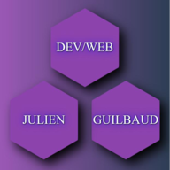

- # 👋 Hi, I’m Julien GUILBAUD <!--qui je suis-->

- ## 🏢 I'm a student at [O'CLOCK](https://oclock.io/) in accessibility web developer <!--ce que je suis-->

- ## 👀 I’m interested in all development languages <!--ce qui me plait-->

---
  
- ## 🌳🌲 I’m currently use <!--ce que j'utilise-->

- ### 🎨 Front/End

| MARKDOWN                     | HTML5                        | CSS3                        | SASS                         | JavaScript                 | REACT.js                      |
|:----------------------------:|:----------------------------:|:---------------------------:|:----------------------------:|:--------------------------:|:-----------------------------:|
|||||||

- ### 🛠 Other Techno

| PARCEL.js                      | NPM.js                      | VS CODE                    | GIT                         |
|:------------------------------:|:---------------------------:|:--------------------------:|:---------------------------:|
|||||

- ### ⚙ Back/End

| NODE.js                      | Express.js                  |
|:----------------------------:|:---------------------------:|
|||

---

- ## 🌱I'm currently learning <!-- ce que j'apprend -->

| TypeScript                 | WEBPACK                    |   
|:--------------------------:|:--------------------------:|    
||| 

---

- ## 💞️ I’m looking to collaborate on all you want <!--ce que je voudrais faire-->

**I like to take up challenges**

- ## 📫 How to reach me ... <!--comment me joindre-->

<a href="https://www.linkedin.com/in/julien-guilbaud-b1059222a/" target="_blank" rel="noopener noreferrer">  LINKEDIN PROFIL</a>

<a href="https://julienguilbaud.github.io/" target="_blank" rel="noopener noreferrer">  PORTFOLIO</a>

- ## Github trophy <!--mes trophés github-->

<!--ce que je ne maitrise pas -->

*Thank you for your attention.*

*And sorry for my english.*

 <video src="/media/mind-blown@2x.webm" autoplay muted loop></video>

<!---work in progress travail en cours--->

---
